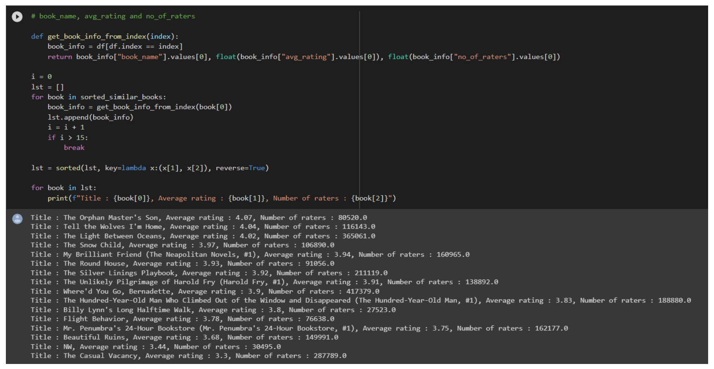

# 📚 Book Recommendation System

This project is a book recommendation system built using collaborative filtering on a Goodreads dataset. The goal is to recommend books similar to a selected title based on user ratings.

## 📌 Overview

- Uses cosine similarity to find books similar to a target book.
- Returns top 15 similar books, sorted by average rating and number of ratings.
- Displays: Title, Average Rating, Number of Raters.

## 📂 Files

- `Project part 2 - Recommendation system.ipynb` – Main notebook with all code.
- `Goodreads_best1500books.csv` – Dataset of 1500 books with ratings and metadata.
- `screenshot.png` – Preview of recommendation results.

## 🧪 How It Works

1. Load the dataset and preprocess (filter books with few ratings).
2. Build similarity matrix based on user ratings.
3. Define function to extract book info: title, rating, raters.
4. Return 15 most similar books and display in descending rating order.

## 💡 Example Output

```
Title : The Orphan Master's Son, Average rating : 4.07, Number of raters : 80520.0
Title : Tell the Wolves I'm Home, Average rating : 4.04, Number of raters : 116143.0
...
```

## 🖼 Preview



## 📦 Requirements

- Python
- Pandas
- Scikit-learn
- Jupyter Notebook

## 🧠 Author

Yuqi Su  
[GitHub Profile](https://github.com/yuqi-yuki)

---

📈 Explore the world of books and find your next great read!
